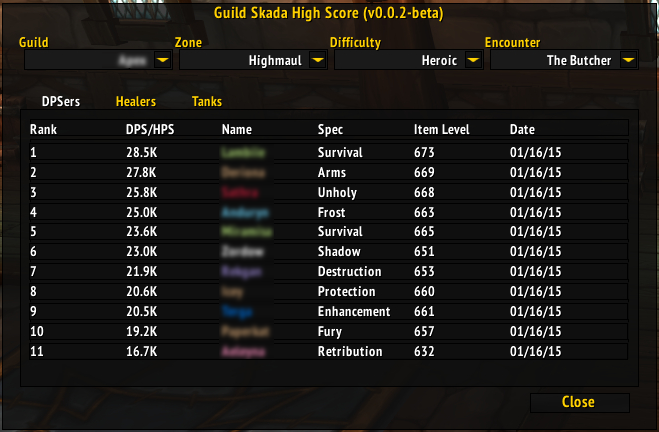

# Guild Skada High Score (GSHS)

An addon for tracking and ranking dps/hps for raid encounters defeated by a guild, for quick in-game comparisons to previous kills.

Feel free to suggest features or report bugs on [GitHub](https://github.com/verath/GuildSkadaHighScore/issues), or leave a comment on Curse!

## Features

* Tracks damage and healing for successful boss kills in current raids, grouped by guild, difficulty and role.
* Attempts to store the item level and talent specialisation for each player for each kill. (This feature requires an inspection of each member, which might fail).
* GUI for displaying the recorded parses, sorted by DPS/HPS.
* Filtering of parses by player name, player specialization or fight date.
* Reporting of data to in-game chats.
* Purging of old/not wanted data. Done automatically if enabled in the addon settings (interface->addons->GuildSkadaHighScore).

## Requirements
The addon was created to be used together with [Skada](https://mods.curse.com/addons/wow/skada). Without Skada, the addon will still load and allow viewing old data. However, to collect new data Skada must be installed and enabled.

## Usage
The addon automatically stores data when an encounter in a tracked raid ends. The data stored is what is reported by the damage meter at the end of combat, and as such resetting the damage meter mid-fight will result in (probably) the wrong data being stored.

### GUI
Type `/gshs` to bring up the GUI.
